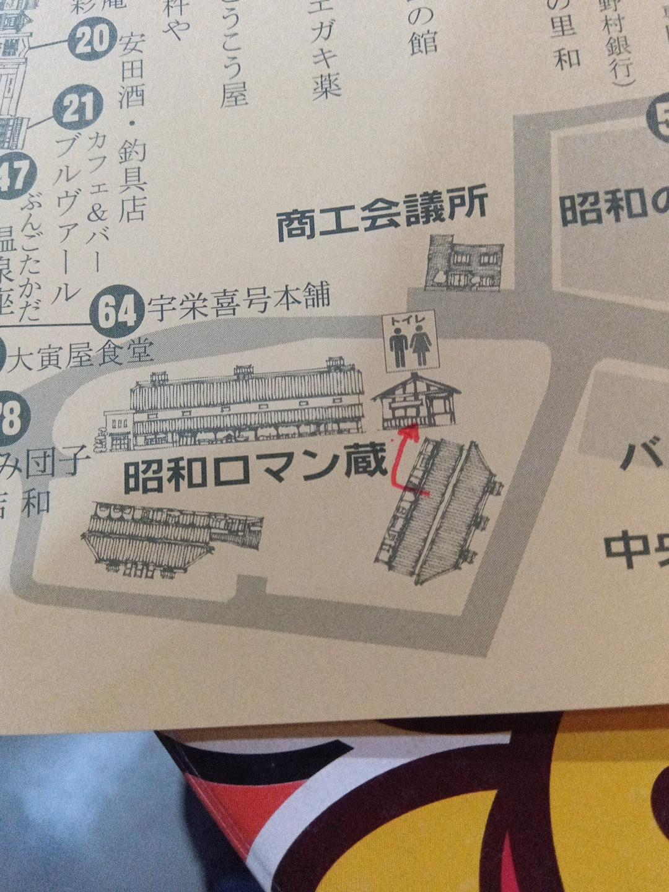
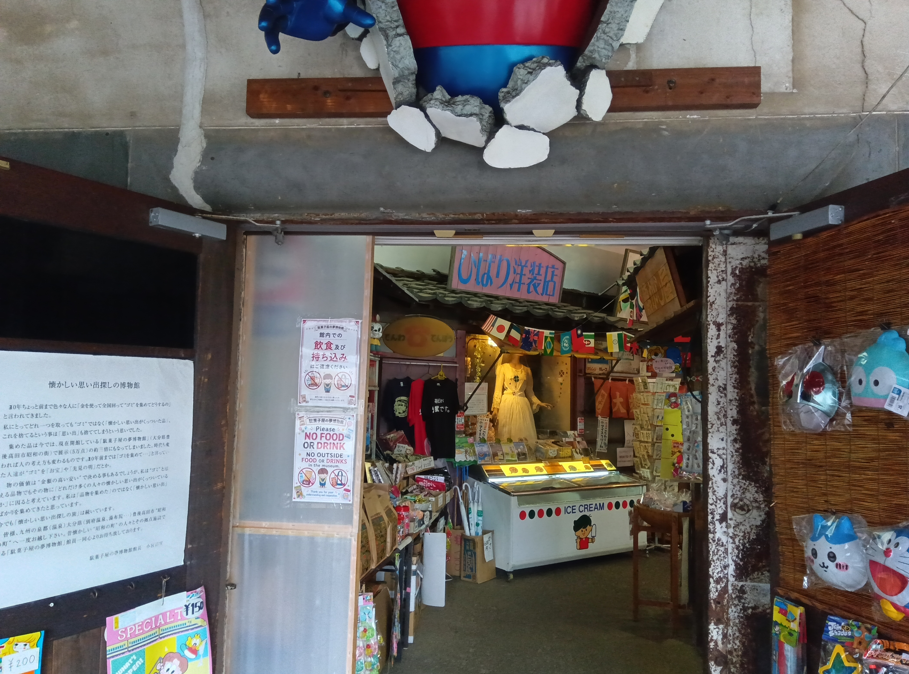
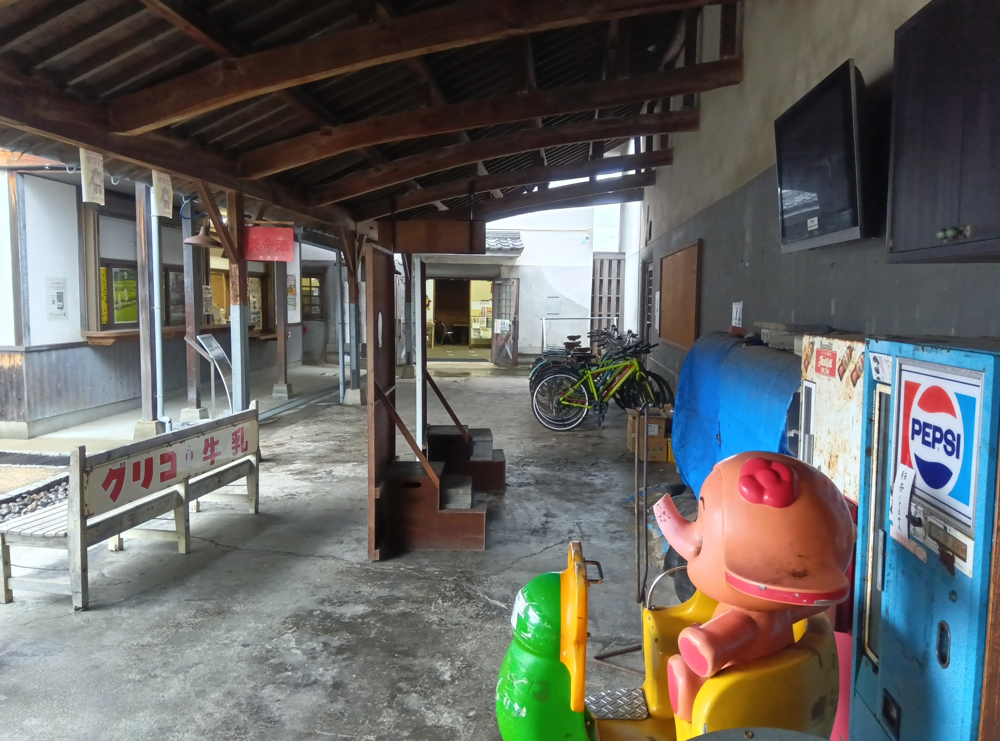
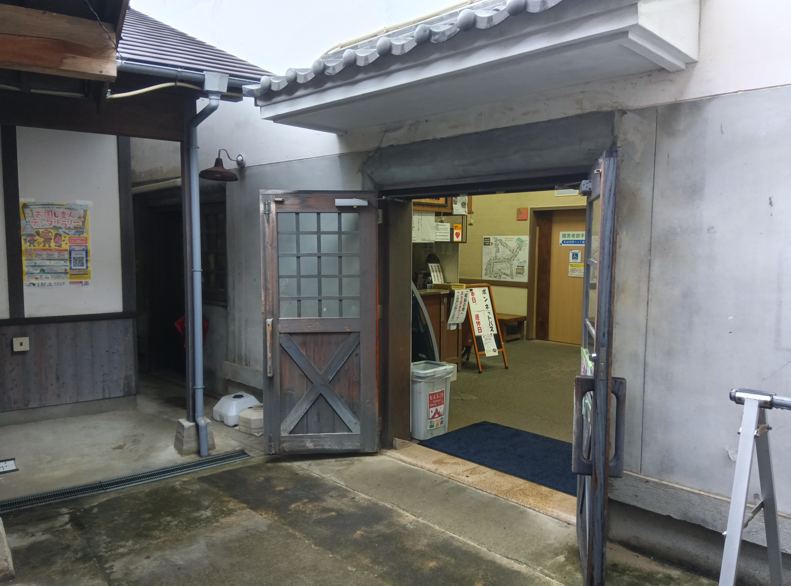
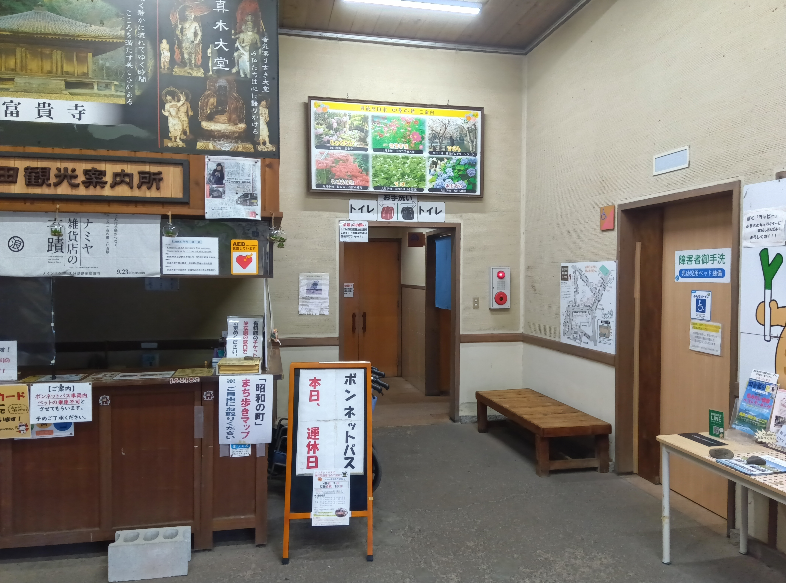

# お手洗い案内テンプレート

小規模店舗・施設向けの、印刷して使える「お手洗い案内」のテンプレートです。

## 用途

館内や店内にトイレがない場合に、近隣のお手洗いの場所を分かりやすく案内するために使用します。

## 今後追加予定

- A4縦サイズの案内
- 日本語版
- 日本語・英語併記版
- PNG見本画像
- 印刷用PDF

## 使用について

内容は利用する店舗や施設に合わせて、場所・方向・注意事項などを変更して使用してください。
## 実際の案内例

### 1. ロマン蔵全体図

### 2. 博物館入口

### 3. 博物館入口付近

### 4. 博物館入口からロマン蔵中庭入口へ

### 5. ロマン蔵案内所から中庭への入口

### 6. ロマン蔵案内所トイレ入口

### 7. 中庭の様子

### 完成版PDF
[お手洗い案内・仕上げ版を開く](お手洗い案内_仕上げ版.pdf)
